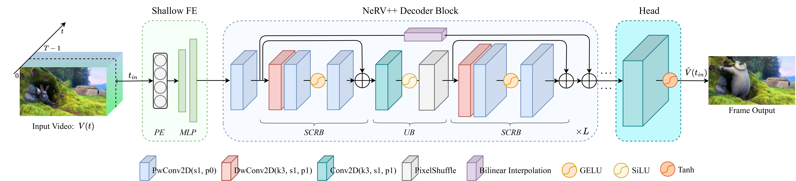

# NeRV++: An Enhanced Implicit Neural Video Representation
Official Pytorch implementation of [NeRV++: An Enhanced Implicit Neural Video Representation](https://arxiv.org/abs/2402.18305). 

* [NeRV++](#nerv++)
  * [Tags](#tags)
  * [Overall NeRV++ Framework](#overall-nerv++-framework)
  * [Disclaimer](#disclaimer)
  * [Documentation](#documentation)
  * [Requirements](#requirements)
  * [Folder Structure](#folder-structure)
  * [Reproducing Experiments](#reproducing-experiments)
  * [Model Pruning](#model-pruning)
  * [Citation](#citation)
  * [License](#license)
    
<!-- /code_chunk_output -->

## Tags
<code>Implicit Neural Representation</code> <code>Neural Codec</code> <code>Neural Video Compression</code> <code>Pytorch</code>

## Overall NeRV++ Framework


## Disclaimer
Please do not hesitate to open an issue to inform of any problem you may find within this repository. Also, you can [email me](mailto:ahmed.ghorbel888@gmail.com?subject=[GitHub]) for questions or comments. 

## Requirements
<code>Python >= 3.6</code> <code>Pytorch</code>

All packages used in this repository are listed in [requirements.txt](https://github.com/ahmedgh970/NeRV-plus-plus/blob/main/requirements.txt).
To install those, run:
```
pip install -r requirements.txt
```

## Folder Structure
``` 
NeRV-PlusPlus-main
├── data/                         # Video data dir
├── docs/asset                    # Documentation figures               
├── selective_scan/               # Selective SSM dir
├── models/                       # Backbones dir
│   └── layers.py                 # Layers
│   └── model_best.py             # NeRV++ backbone    
|   └── ...           
├── requirements.txt              # Requirements
├── utils.py                      # Utility functions
├── train.py                      # Training script
└── main.py                       # Main script
```

## Reproducing experiments

### Training experiments
The NeRV++ XS experiment on 'big buck bunny' can be reproduced with, NeRV++ {S, M, L} with {```9_16_26```, ```9_16_58```, ```9_16_112```} for ```fc_hw_dim``` respectively.
```
python train.py -e 300 --lower-width 80 --num-blocks 1 --dataset bunny --frame_gap 1 \
        --outf bunny_ab --embed 1.25_40 --stem_dim_num 512_1 --reduction 2 --fc_hw_dim 9_16_8 --expansion 1 \
        --single_res --loss Fusion6 --warmup 0.2 --lr_type cosine --strides 5 2 2 2 2 --conv_type conv \
        -b 1 --lr 0.0005 --norm none --act swish
```

### Evaluation experiments
To evaluate pre-trained model, just add --eval_Only and specify model path with --weight, you can specify model quantization with ```--quant_bit [bit_lenght]```, yuo can test decoding speed with ```--eval_fps```, below we preovide sample commends for NeRV-S on bunny dataset
```
python train.py -e 300 --lower-width 80 --num-blocks 1 --dataset bunny --frame_gap 1 \
        --outf bunny_ab --embed 1.25_40 --stem_dim_num 512_1 --reduction 2 --fc_hw_dim 9_16_8 --expansion 1 \
        --single_res --loss Fusion6 --warmup 0.2 --lr_type cosine --strides 5 2 2 2 2 --conv_type conv \
        -b 1 --lr 0.0005 --norm none --act swish \
        --weight output/nerv_plus/bunny_ab/.../model_latest.pth --eval_only
```

### Decoding: Dump predictions with pre-trained model 
To dump predictions with pre-trained model, just add ```--dump_images``` besides ```--eval_Only``` and specify model path with ```--weight```
```
python train.py -e 300 --lower-width 80 --num-blocks 1 --dataset bunny --frame_gap 1 \
        --outf bunny_ab --embed 1.25_40 --stem_dim_num 512_1 --reduction 2 --fc_hw_dim 9_16_8 --expansion 1 \
        --single_res --loss Fusion6 --warmup 0.2 --lr_type cosine --strides 5 2 2 2 2 --conv_type conv \
        -b 1 --lr 0.0005 --norm none --act swish \
        --weight output/nerv_plus/bunny_ab/.../model_latest.pth --eval_only --dump_images
```

## Model Pruning

### Evaluate the pruned model
Prune a pre-trained model and fine-tune to recover its performance, with ```--prune_ratio``` to specify model parameter amount to be pruned, ```--weight``` to specify the pre-trained model, ```--not_resume_epoch``` to skip loading the pre-trained weights epoch to restart fine-tune
```
python train.py -e 100 --lower-width 80 --num-blocks 1 --dataset bunny --frame_gap 1 \
    --outf prune_ab --embed 1.25_40 --stem_dim_num 512_1 --reduction 2 --fc_hw_dim 9_16_8 --expansion 1 \
    --single_res --loss Fusion6 --warmup 0. --lr_type cosine --strides 5 2 2 2 2 --conv_type conv \
    -b 1 --lr 0.0005 --norm none --suffix 107 --act swish \
    --weight output/nerv_plus/bunny_ab/.../model_latest.pth --not_resume_epoch --prune_ratio 0.4
```

### Evaluate the pruned and quantized model
To evaluate pruned model, using ```--weight``` to specify the pruned model weight, ```--prune_ratio``` to initialize the ```weight_mask``` for checkpoint loading, ```eval_only``` for evaluation mode, ```--quant_bit``` to specify quantization bit length, ```--quant_axis``` to specify quantization axis
```
python train.py -e 100 --lower-width 80 --num-blocks 1 --dataset bunny --frame_gap 1 \
    --outf dbg --embed 1.25_40 --stem_dim_num 512_1 --reduction 2 --fc_hw_dim 9_16_8 --expansion 1 \
    --single_res --loss Fusion6 --warmup 0. --lr_type cosine --strides 5 2 2 2 2 --conv_type conv \
    -b 1 --lr 0.0005 --norm none --suffix 107 --act swish \
    --weight output/nerv_plus/prune_ab/.../model_latest.pth --prune_ratio 0.4 --eval_only --quant_bit 8 --quant_axis 1
```

### Distrotion-Compression result
The final bits-per-pixel (bpp) is computed by $$ModelParameter * (1 - ModelSparsity) * QuantBit / PixelNum$$.

## Citation
If you use this library for research purposes, please cite:
```
@INPROCEEDINGS{,
  author={Ghorbel, Ahmed and Hamidouche, Wassim},
  booktitle={}, 
  title={NeRV++: An Enhanced Implicit Neural Video Representation}, 
  year={2025},
  volume={},
  number={},
  pages={},
}
```

## License
This project is licensed under the MIT License. See LICENSE for more details